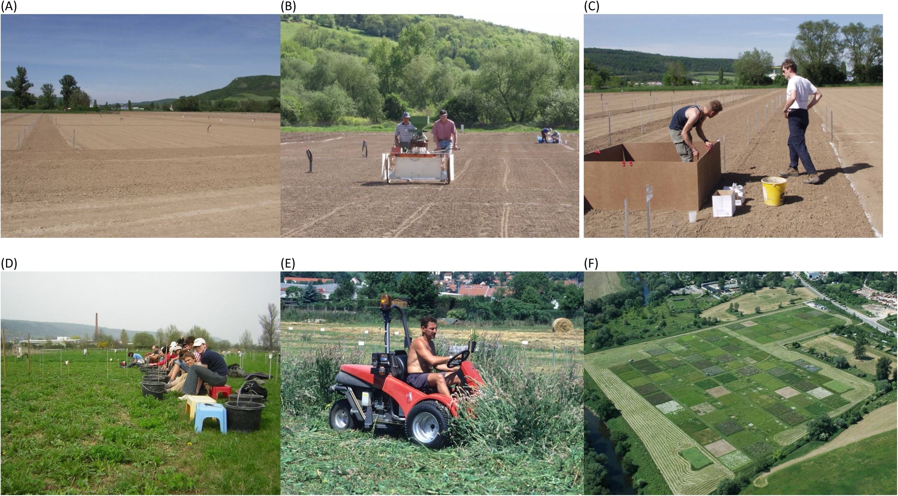
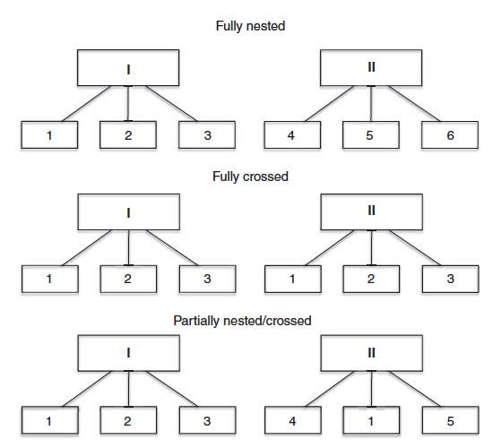

```{r setup2, include=FALSE}
knitr::opts_chunk$set(echo = TRUE)
packages_needed <- c("ggplot2", # graphics
                     "dplyr",
                     "arm", # display() etc.
                     "MASS",
                     "ggfortify",
                     "nlme",
                     "lme4",
                     "lmerTest"
                     )
pk_to_install <- packages_needed [!( packages_needed %in% rownames(installed.packages())  )]
if(length(pk_to_install)>0 ){
  install.packages(pk_to_install,repos="http://cran.r-project.org")
}
#lapply(packages_needed, require, character.only = TRUE)
library(ggplot2)
library(dplyr)
library(arm)
library(MASS)
library(ggfortify)
library(nlme)
library(lme4)
library(lmerTest)
```
Background: https://www.youtube.com/watch?v=-4K-kKXNths

Up to this point our analyses have dealt mainly with just one or two explanatory variables, and for the most part these have been experimental treatments that have been deliberately applied in a particular way. These types of explanatory variables are often referred to as **fixed effects** (we fix the levels of the experimental treatments).

However, there is often hierarchical structure in our data, such as with blocked designs. Sometimes we deliberately choose to have blocked designs, but in other cases they are forced upon us by circumstances. Sometimes we might know how the blocks differ, but this knowledge is never complete and we often have little idea how or why one block differs from another. We just know that blocks will differ due to the ubiquitous variability of the natural world.

These blocking terms and related variables go by a variety of names including nuisance variables and **random effects**. Statistical models that include both fixed and random effects are called mixed-effects models, or sometimes just **mixed models**.

**Fixed vs. Random Effects**
Dingemanse and Dochtermann (2013; J. Animal Ecology 82:39-54)

Mixed-effect models incorporate two types of parameters:

1. The effects that predictor variables – which can be continuous (covariates) or categorical (factors) – have on the mean of response variables. Such effects are called **‘fixed’** whenever specific effects are estimated at their observed levels (e.g. differences in means between four specific years of study).

A “fixed variable” is one that is assumed to be measured without error (e.g. sex).

It is also assumed that the values of a fixed variable in one study are the same as the values of the fixed variable in another study (e.g. burned, unburned; control, experimental).

2. Effects on response variables generated by variation within and among levels of a predictor variable (factor). Effects of such predictor variables are called **‘random’** whenever variance is estimated among observed levels sampled from a population of levels.
  
You can think of the values of random variables as representing a random sample of all possible values or instances of that variable (age, IQ, body mass, blood pressure), including repeated sampling of replicates (individuals, plots, etc) across time. 

We expect to generalize the results obtained with a random variable to all other possible instances of that value.  In traditional ANOVA and regression analysis we assume the predictor variables are fixed, but mixed-effects models allow us to relax that assumption (and calculations are also relaxed).

**Part One**  
**Repeated Measures Example**  
One of the main assumptions of a traditional OLS regression model is that collected samples are independent. What about a design where you measure the same replicates more than once, like a before-after comparison? Observations are obviously not independent. 
```{r}
treat  = rep(c('treat', 'control'), e=5)
pre = c(20,10,60,20,10,50,10,40,20,10)
post = c(70,50,90,60,50,20,10,30,50,10)

dfwide <- data.frame(id=factor(1:10), treat, pre, post) #wide data frame
dflong <- tidyr::gather(dfwide, key=time, value=score, pre:post) %>% arrange(id) #long dataframe
dflong$time = factor(dflong$time, levels = c("pre", "post")) #reorder factor to be pre then post
```

```{r}
ggplot(dflong, aes(x=time, y=score, color=treat)) + 
  geom_line(aes(group=id)) +
  geom_point(size=3) +
  ggtitle("Effect of Gingko on Test of Memory Performance")

```
```{r fit linear model}
lm1 <- lm(score ~ treat + time + treat*time, data=dflong)
anova(lm1)
```
**THIS IS WHAT NOT TO DO! This model has ONLY Fixed Effects.**  
This model is fit using only fixed effects, producing WAY too many residual df. Does not account for the hierarchical nature of the experiment; individuals are tested multiple times in each treatment. Number of individuals was only n=10, so this model has artificially inflated sample size. This analysis can't possibly be correct.
```{r fit mixed model}
lmeModel <- lmer(score ~ treat*time + (1|id), data=dflong)
anova(lmeModel)
#notice that the default for mixed models has slightly different output than normal OLS model.
```
However, now we are using a tool that can handle additional time points, continuous covariates with possibly nonlinear relationships, different types of outcome variables, other correlational structures among the observations, etc. In fact, if one looks at the help file for `aov`, one will note that it suggests using `lme` for unbalanced designs and other situations.  

<span style="color:blue">*The slot machine example "Machine" is an example (in this repository) of a mixed-model with unbalanced sample sizes.*</span>

<span style="color:green">*The coyote-fox home range example "Animals" is an example (in this repository) of a mixed-model with perfectly balanced sample sizes.*</span>

**Biodepth Example**
```{r}
biodepth <- read.delim("data/biodepth.txt", header=TRUE)
```
The BIODEPTH (Biodiversity and Ecosystem Processes in Terrestrial Herbaceous Ecosystems)
project manipulated levels of grassland plant diversity in field plots to simulate the
impact of the loss of plant species on ecosystem processes.

Source: Hector et al. 1999 Science ; Spehn et al. 2005 Ecological Monographs
www.esapubs.org/archive/mono/M075/001

**Aim: Effects of diversity on yield within 8 European grasslands**

'data.frame':	480 obs. of  9 variables:

Plot      : Factor w/ 480 levels (field plots = experimental units)

Site      : Factor w/ 8 levels "Germany","Greece" (Fieldsites; **Random** grouping factor)

Block     : Factor w/ 15 levels (2 blocks per site except Portugal; **Random** grouping factor)

Mix       : Factor w/ 200 levels (partially crossed species mixtures within sites)

Mix_Nested: Factor w/ 220 levels (assuming full nesting of ecotypes within sites)

Diversity : No. of plant species per plot (primary explanatory variable (**Fixed** effect))

Shoot2    : Aboveground biomass harvested in year 2 (g m-2) [**Response**]

Shoot3    : Aboveground biomass harvested in year 3 (g m-2) [**Response**]

Diversity2: Diversity log transformed to base 2

{width=800px}

```{r convert and transform variables as needed}
biodepth$Mix <- factor(biodepth$Mix)
# Convert mixtures to factor
biodepth$Diversity2 <- log(biodepth$Diversity,2)
# transform log base 2
# Take year 2 as response variable
biodepth$Yield <- biodepth$Shoot2
str(biodepth)
```
```{r qplot of Yield vs number of species, message=FALSE, warning=FALSE}
# Yield vs number of species for a 'no pooling analysis'
qplot(Diversity, Yield, data= biodepth, geom= c("point", "smooth"), method= "lm",
      xlab= "Number of species", ylab= "Yield", main= "No pooling analysis: Separated by Site (Country)",
      facets=.~Site)+scale_x_continuous(trans= "log2")+theme_bw()
```
Note that the x-axis in the plots are log transformed because
in general this produces approximately linear relationships (productivity
cannot increase without limit, leading us to expect declining returns with
increasing diversity which will be roughly linear once diversity is logged).

As is typical of ecological data there is plenty of variability, but
in general there **seems to be a positive relationship between the hay yield
of the experimental grassland plots and the number of species they were
sown with**. Intercepts vary as well, indicating that sites have different levels of
productivity (due to soil, climate etc).

The point of fitting this model here is to help us understand the
mixed-effects analysis we want to build from these initial simple
extremes. One way to think of the mixed-effects analysis is as a **compromise
between the no-pooling and complete-pooling models**.  

Before we begin the mixed-effects analysis there is one more fixed-effects model we
should fit.
```{r message=FALSE, warning=FALSE}
qplot(Diversity, Yield, data= biodepth, 
      geom= c("point", "smooth"), method= "lm", main= "Complete pooling analysis: All sites combined",
      xlab= "Number of species", ylab= "Yield")+scale_x_continuous(trans= "log2")+theme_bw()
```
Notice that by pooling the data, all the hierarchical structure is lost.

**Mixed-model ANOVA using normal least squares**

Prior to the relatively recent introduction of modern mixed-effects models, a typical ecological analysis might well have consisted of fitting separate relationships for each site. However, we could also consider a normal least squares analysis using the `lm()` function that includes diversity, site, and the interaction. This is similar to an ANCOVA model:
```{r ordinary least squares model}
ls0 <- lm(Yield ~ Site + Diversity2 + Site:Diversity2, data=biodepth)
```
This model ignores the fact that the design is **blocked within sites**, and that the experiment also looks at the effects of species composition by replicating each species that is grown in monoculture and each mixture of species grown in polyculture (the factor Mix with 200 levels). To include these factors we have to extend from an ANCOVA to a more complex general linear model with several explanatory variables and nuisance terms.
```{r}
CH <- subset(biodepth, Site=="Switzerland")
# Reorder by levels of diversity
CH[order( factor(CH$Diversity) ), ]
# create colour and shape combinations to specify 32 mixtures
cols <- rep(c('black','red','green4','blue'), each = 8)
shapes <- rep(c(1:8),4)
FigTen3 <- qplot(Diversity, Yield, data= CH, geom= c("point"),
                 xlab= "Number of species", ylab= "Yield", main= "Example from Switzerland; note 32 combinations of mixtures",
                 facets=.~Block, colour=Mix, shape=Mix)+
                 scale_x_continuous(trans= "log2")+theme_bw()
FigTen3 + theme(legend.position="none") + scale_colour_manual(values=cols) + scale_shape_manual(values=shapes)
```
The BIODEPTH experimental design at one example field site (Switzerland). At each site the regression of yield on diversity is repeated in two blocks (D and E). To separate the effects of species number (diversity) and species composition, replicate communities within each diversity level have different species composition. Each species composition (monoculture or polyculture) occurs once within each block so that both species richness and composition are replicated.
```{r}
ls1 <- lm(terms(Yield~Site+Block+Diversity2+Site:Diversity2+Mix+Site:Mix, keep.order= TRUE), data= biodepth)
```
This type of complex **normal least squares analysis** with a combination of fixed and random effects is often called **mixed-model ANOVA**. The R code is unfortunately complex: we need the `terms()` function to specify the order in which the SS are calculated to be the same as the order of terms in the model sequence (otherwise R would put all the main effects first, then the two-way interactions, and so on, which does not work with this design since the diversity effects are a subset of the mixture effects—as you will see if you try fitting the mixture terms before the diversity terms).
```{r fit model via least-squares}
anova(ls1)
```
Unfortunately, the P-values for models fitted using the `lm()` function are produced by dividing the mean squares for each term by the residual mean square in the final row. However, because of the complexity of the design our analysis has multiple levels, and different levels have different error terms. Some of the F- and P-values in the `summary()` output given here are therefore tested against inappropriate error terms and cannot be trusted.

One of the key messages is that it is normally better to focus on the estimates and intervals rather than the P-values (because what does it really mean when everything is 'significant'?).
Another take home message is that trying to do complex mixed-model analysis within the least squares framework is fraught with difficulties and limitations and it is **better to adopt the modern maximum likelihood-based approach** to mixed-effects models.

**Maximum likelihood-based mixed-effects models in R**

Start by fitting a model that doesn't consider any interactions (keep it simple initially). We are analysing the response, yield, as a function of the fixed effect of diversity (using the log2 transformed version again) with simple random effects for sites, blocks, and mixtures. We will examine the way we specify the random effects in greater detail later but the key point to understand is that the `lme()` function **can only deal with nested random effects** as indicated by the forward slashes between site, block, and mix.

Example of Russian Dolls 'Nested' Within One Another; Analogous to Nested Effects in Model Specification
{width=400px}
```{r}
library(nlme)
mem1 <- lme(Yield~Diversity2, random= ~1|Site/Block/Mix, na.action= na.exclude, data= biodepth)
summary(mem1)
```
Things start well—8 sites and 15 blocks are both correct—but `lme()` fails to correctly pick out the factor
for the mixtures (with 200 levels) and instead reports 429 groups! This is because the random effects in this analysis are not fully nested but are partially crossed.

Understanding the difference between nested and crossed random effects is critical. First, `lme()` is really set up to deal only with fully nested designs, so if we want to use `lme()` we must be sure we have only nested random effects. Secondly, the newer `lme4` package can handle both nested and crossed random effects, which means that we must correctly specify them by coding them appropriately in the dataframe.

Whether random effects are nested or crossed is a property of the data, not the model. However, when fitting the model, effects can be included as either nested or crossed.

**Nested random effects** are when each member of one group is contained entirely within a single unit of another group. The canonical example is students in classrooms; you may have repeated measures per student, but each student belongs to a single classroom (assuming no reassignments).

**Crossed random effects** are when this nesting is not true. An example would be different seeds and different fields used for planting crops. Seeds of the same type can be planted in different fields, and each field can have multiple seeds in it.



If each mixture occurred in only one block then the design would be fully nested. If every mixture was replicated in every block then the design would be fully crossed. In fact what we have is something in between that looks like the bottom panel. Mixtures in the BIODEPTH design are mostly nested within blocks but some do reoccur in different blocks introducing partial crossing.

In order to deal with designs with crossed random effects we have to use the `lmer()` function from the `lme4` package instead. The `lme4` package also contains the `lmList()` function that will fit an `lm()` model within each group—site in this case:
```{r}
detach(package: nlme) # to avoid potential conflicts with lme4
library(lme4)
lmList(Yield~Diversity2|Site, data= biodepth)
```
Check these values against the multi-panel figure above (Yield~Number of Species).

The model-building approach recommends starting with a model that is as complex or slightly more complex than we
anticipate we will need. We can then consider whether or not to simplify this model. In this case we could begin with a model including interactions for both the site-by-diversity and site-by-mixture terms (the crossed random effects).

The site-by-diversity interaction in the random effects allows variation among sites in the regression intercepts and slopes and is sometimes called a **random intercepts and slopes model** (as opposed to one with random intercepts only where the slopes are fixed to be parallel at different sites). Helpfully, the syntax for fitting mixed-effects models in `lmer()` has been simplified relative to `lme()`:

```{r}
mer1 <- lmer(Yield~Diversity2 +(1+Diversity2|Site)+(1|Block)+(1|Mix)+(1|Site:Mix), data= biodepth)
summary(mer1)
```
As before, a good place to start is at the bottom of the `summary()` or `display()`
function output to check whether the structure has been understood.
The newer function properly identifies the number of sites, blocks,
and mixtures (the number of groups for mixtures is given as 198 not 200,
due to missing values).

##Likelihood ratio tests of random effects

In model-building, we would normally want to keep the main effects for sites, blocks, and mixtures since
they reflect the core structure of the design, but we could consider whether or not to include the interaction terms. The recommended approach is to remove one term at a time from the random effects and to judge whether to retain it or not using a likelihood ratio test to compare the model with and without the effect in question (considering only one effect at a time).

Note that these are 'nested models'!

```{r message=FALSE, warning=FALSE}
mer1 <- lmer(Yield~Diversity2 +(1+Diversity2|Site)+(1|Block)+(1|Mix)+(1|Site:Mix), data= biodepth) #from above
mer2 <- lmer(Yield~Diversity2 +(1+Diversity2|Site)+(1|Block)+(1|Mix), data= biodepth)
anova(mer1, mer2)
```
Because likelihood ratio tests are recommended for assessing random effects we shall postpone discussion of the AIC and the Bayesian information criterion (BIC) until later. The difference between the simpler and more complex model—that is the interaction in question—is highly significant by the chi-square value produced by the likelihood ratio test.

Following this approach we will keep the site-by-mixture interaction in the random effects. Although we would normally retain the random effect for block in the model to reflect its role in the design we can test its importance here as a demonstration of how optional terms could be removed from the random effects:
```{r message=FALSE, warning=FALSE}
mer3 <- lmer(Yield~Diversity2 +(1+Diversity2|Site)+(1|Mix)+(1|Site:Mix), data= biodepth)
anova(mer1, mer3)
```
In contrast to the previous test, in this case the effect of block is nonsignificant. However, we shouldn’t let the tail wag the dog and we will retain the block effect as a basic component of the experimental design. So while the approach based on null hypothesis significance testing and P-values is slightly at odds with the estimation-based analysis recommended, we will let the general considerations drive our
model selection and not blindly follow the P-values.

#Part Two

##Random intercepts vs. random intercept and slope models