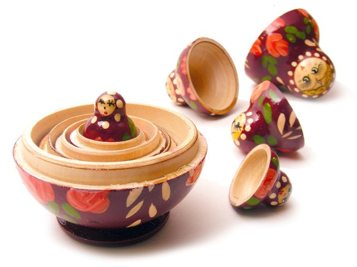

```{r setup2, include=FALSE}
knitr::opts_chunk$set(echo = TRUE)
packages_needed <- c("ggplot2", # graphics
                     "dplyr",
                     "arm", # display() etc.
                     "MASS",
                     "ggfortify",
                     "nlme",
                     "lme4",
                     "lmerTest",
                     "asbio"
                     )
pk_to_install <- packages_needed [!( packages_needed %in% rownames(installed.packages())  )]
if(length(pk_to_install)>0 ){
  install.packages(pk_to_install,repos="http://cran.r-project.org")
}
#lapply(packages_needed, require, character.only = TRUE)
library(ggplot2)
library(dplyr)
library(arm)
library(MASS)
library(ggfortify)
library(nlme)
library(lme4)
library(lmerTest)
library(asbio) # Aho 2014 example data
```
**Review of Fixed vs. Random Effects** (Aho 2014)

**Fixed factor** levels have two characteristics: (1) they are not an obvious subset of a population
of factor levels, and (2) the factor levels are informative, and are chosen by the investigator
specifically because they have a unique and important meaning. Examples of fixed
factor levels include:  

 * Male and female
 * Predator and prey
 * Drug A, drug B, and drug C
 * Control and treatment
 * Before and after
 * Tree, grass, shrub, and so on
 * Particular variants on a predictor, for example, “high”, “medium”, and “low”  
 
**Random factor** levels have two characteristics: (1) the selected factor levels often can be
considered a subset from a population of possible levels, and (2) the factor levels are not informative.
Because of these characteristics, we are unlikely to care about particular differences
among factor levels. Random factor levels include:  

 * Time intervals in a time sequence
 * A collection of seed types (or some other levels) chosen randomly from a population
of seed types (or some other population)
 * Nested groups in an observational study
 * Subjects on whom repeated measurements are made

If all factors contain fixed factor levels, then one would use a conventional fixed effect
model for hypothesis testing procedures. Conversely, if all factors are random, then one
should use a random effect model. A design with both random and fixed factors will require
a *mixed effect model*. Fixed, random, and mixed effect models are also called model I, model
II, and model III ANOVAs, respectively.
\
\
**Examples of different types of hierarchical models** (Schielzeth and Nakagawa 2013, Methods in Ecology and Evolution)
https://besjournals.onlinelibrary.wiley.com/doi/10.1111/j.2041-210x.2012.00251.x
\
\

\
\
**Nested Design: Mosquito Wing Length** (Aho 2014, Example 10.13)  
Sokal and Rohlf (2012) measured the variability in wing length (in micrometers) for
female mosquitos (*Aedes intrudens*). Four females were randomly selected from each of three
cages and two measurements were made on the left wing of each. Both cage and female
(in cage) can be seen as random effects. The data are in the dataframe mosquito.
```{r plot mosquito data}
data(mosquito)
ggplot(mosquito, aes(cage, length, colour = female)) + 
  geom_jitter(aes(fill=female), colour="black",pch=21, size=5, width = .05)
```

This figure is confusing because of the way the data are coded; all numbers. We actually have 12 females total.
We need a graph that makes sense before we can make some models.

```{r look at the coding}
#Look at the coding of replicates in the mosquito dataset
mosquito
```


```{r less confusing mosquito figure}
mosquito.recoded <- read.csv("../data/mosquito.recoded.csv")
ggplot(mosquito.recoded, aes(cage, length, colour = as.factor(female), shape=as.factor(measures))) + 
  geom_jitter(width =0.15, size=5) +
  annotate("text", x = 2, y = 82.5, label = "12 females") +
  annotate("text", x = 2, y = 80, label = "2 measures per female") +
  annotate("text", x = 2, y = 77.5, label = "24 total measurements", size=5, color="blue") +
  geom_hline(yintercept = 66.63, linetype="dotted")
```

```{r random effects mosquito model and anova}
aedes.1 <- lmer(length ~ (1|cage/female), data = mosquito)
anova(aedes.1)
```
Its not happy, no fixed effects to evaluate, other than intercept of the model,
which is the mean of the wing measurements.

```{r mosquito model summary}
summary(aedes.1)
```

This model specification makes sense: "Number of obs: 24, groups:  female:cage, 12; cage, 3"

Because the design is perfectly balanced, we can obtain the variance component estimates
using mean squares from a conventional ANOVA. But this is confusing because df are different than what we might expect (there were only 12 mosquitos in the experiment).
```{r linear model}
anova(lm(length ~ cage/female, data = mosquito))
```
But maybe we are actually specifically interested in the differences among cages (cage as fixed effect); or if we had unbalanced sampling. 
```{r mosquito model2, message=FALSE, warning=FALSE}
aedes.2 <- lmer(length ~ cage + (1|cage/female), data = mosquito)
# aedes.wrong <- lmer(length ~ cage + (1|female), data = mosquito) 
# this notation assumes every female is in every treatment; they are not 
summary(aedes.2)
```
```{r mixed model}
anova(aedes.2)
```
We can test to see which model fits the data best.
```{r}
anova(aedes.2,aedes.1, test = "Chisq")
```
Models are relatively indistinguishable. 
We can also use the `emmeans' package to compare levels (see previous examples).  
\
\
\
**Nested Design: Liver Glycogen in Rats** (Aho 2014, Example 10.14)   
Sokal and Rohlf (2012) described a hierarchical experimental design to determine the
effect of diet on glycogen levels in rat livers. **Six rats** were randomly assigned one of
**three diets**: “control,” “compound 217,” and “compound 217 + sugar.” After a short
period of time, the rats were euthanized and glycogen levels in their livers were measured.
**Two glycogen measurements** were made for each of **three preparations of each liver** from each rat.
In this case, the diet is fixed, while liver preparation (in diet) and
glycogen measurements (in liver in diet) are random.

```{r rat liver plot}
#this visualization is a bit tough because of the way the data are coded (1, 2, 3)
data(rat) #from asbio package
ggplot(rat, aes(diet, glycogen, colour = liver)) + 
  geom_point(size=5) +
  annotate("text", x = 3, y = 160, label = "6 rats, 3 diets = 2 rats/diet") +
  annotate("text", x = 2.85, y = 155, label = "3 liver sections, 2 measurements/section") +
  annotate("text", x = 2.85, y = 145, label = "OK, I'm confused now.")
```
\
As an exercise, make a schematic of what you expect this design to look like.
\
```{r import recoded data for visualization}
rat_recoded <- read.csv("../data/rat_recoded.csv")
ggplot(rat_recoded, aes(diet, glycogen, colour = as.factor(rat), shape=as.factor(liver))) + 
  geom_jitter(width =0.15, size=5) +
  annotate("text", x = 3, y = 160, label = "3 diets with 2 rats/diet") +
  annotate("text", x = 2.85, y = 157, label = "3 liver sections") +
  annotate("text", x = 2.85, y = 154, label = "2 measurements/section") +
  annotate("text", x = 2.85, y = 145, label = "36 total measurements", size=5, color="blue")
```
\
First, **lets do it the wrong way** and show how pseudoreplication can result in incorrect analyses.
Of primary interest is the detection of differences in the fixed factor of diet. By treating
each measure in each liver preparation in each rat as independent observations, we get a model with inflated degrees of freedom.
```{r glycogen linear model}
anova(lm(glycogen ~ diet, data = rat))
```
The analysis tells us that df error = 33; however, there are only six rats. Thus, df error should be
n – a = 6 – 3 = 3. Pseudoreplication has artificially inflated sample sizes, and increased
the probability of type I error.  Using a mixed-model approach, we can obtain variance components estimates for the
model.

```{r message=FALSE, warning=FALSE}
rat.1 <- lmer(glycogen ~ diet + (1|diet/rat/liver), data = rat)
rat.1
```
```{r}
summary(rat.1)
```

Look at how samples are parsed: "Number of obs: 36, groups:  liver:(rat:diet), 18; rat:diet, 6; diet, 3". This makes sense.

```{r}
anova(rat.1)
```
Notice this inference (P=0.23) is much different than the linear model that included pseudoreplicates of individuals (P=3.031e-05).


Example of Russian Dolls 'Nested' Within One Another; Analogous to Nested Effects in Model Specification
{width=400px}

**Nested random effects** are when each member of one group is contained entirely within a single unit of another group. The canonical example is students in classrooms; you may have repeated measures per student, but each student belongs to a single classroom (assuming no reassignments).

**Crossed random effects** are when this nesting is not true. An example would be different seeds and different fields used for planting crops. Seeds of the same type can be planted in different fields, and each field can have multiple seeds in it.


