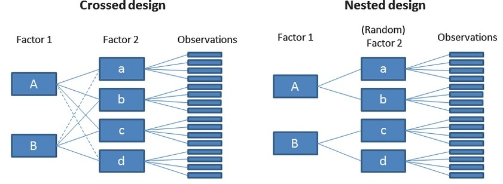

## Mixed Model Syntax in `lme4::lmer`

The `lmer()` function from the **lme4** package fits **linear mixed-effects models** (LMMs).  
General form:

lmer(response ~ fixed_effects + (random_effects | grouping_factor), data = dataset)

## Components

1. **Response Variable** (`response`)
- The outcome (dependent variable) you want to predict (e.g., mass, growth_rate).

2. **Fixed Effects** (`fixed_effects`)
-  Predictors of interest (like in standard regression).

3. **Random Effects Structure** (`random_effects | grouping_factor`)
-  `grouping_factor` = cluster variable (e.g., individual ID, site, year).
-  `random_effects` = which slopes/intercepts are allowed to vary by group.

-----------------------------------------------------------------------------

## Example Models

\

**1. Random Intercept Only**: Each group has its own intercept, but slopes are fixed.

m1 <- lmer(Y ~ X + (1 | Group), data = mydata)

**`1`** = random intercept

**`|`** = "by group"

Example: Individuals differ in baseline body mass, but the effect of temperature is constant.

\

**2. Random Slope Only**: Each group has its own slope, but intercept is fixed.

m2 <- lmer(Y ~ X + (0 + X | Group), data = mydata)

`0 + X` removes the intercept and fits only a random slope.

\

**3. Random Intercept and Random Slope**: Both intercept and slope vary by group.

m3 <- lmer(Y ~ X + (X | Group), data = mydata)

Equivalent to `(1 + X | Group)`

Example: Individuals differ in both baseline mass and how mass changes with temperature.

\

**4. Uncorrelated Random Slope and Intercept**: Intercept and slope vary independently (no correlation term).

m4 <- lmer(Y ~ X + (1 | Group) + (0 + X | Group), data = mydata)

\

## Nested vs Crossed Random Effects

**Nested**

Groups are **hierarchical** (e.g., plots within sites).

m_nested <- lmer(Y ~ X + (1 | Site/Plot), data = mydata)

Equivalent to:

(1 | Site) + (1 | Site:Plot)

**Crossed**

Two random effects are crossed, not nested (e.g., observer and site).

m_crossed <- lmer(Y ~ X + (1 | Site) + (1 | Observer), data = mydata)

## Checking Model Fit
-  `summary`(m3)      # Coefficients, variance components
-  `ranef`(m3)        # Random effects
-  `fixef`(m3)        # Fixed effects only
-  `confint`(m3)      # Confidence intervals
-  `anova`(m1, m3)    # Compare nested models
-  `plot`(m3)         # Diagnostic plots

**References**

Bates, D., Maechler, M., Bolker, B., & Walker, S. (2015). Fitting linear mixed-effects models using lme4. Journal of Statistical Software, 67(1), 1–48.

Zuur, A., Ieno, E. N., Walker, N., Saveliev, A. A., & Smith, G. M. (2009). Mixed Effects Models and Extensions in Ecology with R. Springer.